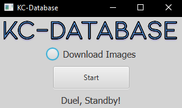

# KC-Database
Ever wanted to make a project with YuGiOh card data? Well search no more because I have developed KC-Database Extractor!
This program allows the user to generate a SQLite database with data from all cards in the Yu-Gi-Oh TCG.
And as a bonus, the user can even download pictures of all the cards in a seperate folder, with a link to the cards' paths in the database!

## Getting Started

For using the program, just download the exe file (or jar if you have java installed) and run the file
For development, just clone the project and open the folder in an IDE

### Prerequisites
*For using the exe file - run Windows
*For the jar file, - Windows, Mac, or Linux with Java installed
*For development - Windows, Mac, or Linux with...
- Java
- JavaFX
- Jsoup
- SQLite-JDBC

## Usage

Double click on the program to open it
Toggle Downloading cards with the download cards button and click start.
Due to the high volume of cards, the extraction may take around 20 -30 minutes, so just wait until the bottom says Extraction Complete!

## Built With

* [Jsoup](https://jsoup.org/)- The Web-Scraper
* [SQLite-JDBC](https://www.sqlitetutorial.net/sqlite-java/sqlite-jdbc-driver/) - The Database Manager

